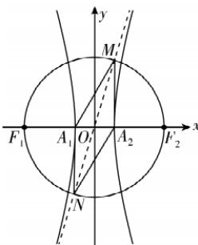

> [!faq]- 答案与解析
>
> > [!success]- **【答案】** ACD
>
> > [!note]- **【解析】**
> > ACD 【解析】不妨设点 M 在第一象限. 因为 M, N 都在以 O 为圆心, $F_{1}F_{2}$ 为直径的圆上, 所以根据对称性有 $|OM| = |ON|$ , 又因为 $|OA_{1}| = |OA_{2}|$ , 所以四边形 $MA_{1}NA_{2}$ 为平行四边形, 所以 $\angle A_{1}MA_{2} = \pi - \angle MA_{1}N = \frac{\pi}{6}$ , 故 A正确.
> > 设 $M\left(x_{0}, \frac{b}{a}x_{0}\right) (x_{0}>0)$ ，根据 $|OM|=c$ ，得 $x_{0}^{2}+\frac{b^{2}}{a^{2}}x_{0}^{2}=c^{2}$ ，解得 $x_{0}=a$ ，
> > 故 $M(a,b), N(-a,-b)$ ，所以 $\angle MA_{2}A_{1}=\frac{\pi}{2}$ ，又因为 $\angle A_{1}MA_{2}=\frac{\pi}{6}$ ，所以 $|MA_{2}|=\frac{\sqrt{3}}{2}|MA_{1}|$ ，故 B 错误.
> > 在 Rt△MA₁A₂ 中，|MA₂|=b, |A₁A₂|=2a, ∠A₁MA₂ = π/6，所以 tan∠A₁MA₂ = |A₁A₂| / |MA₂| = 2a/b = √3/3，即 $\frac{b}{a}=2\sqrt{3}$ 故 $e=\sqrt{1+\frac{b^{2}}{a^{2}}}=\sqrt{13}$ ，故 C 正确.
> > → 敲黑板： $e=\frac{c}{a}=\sqrt{\frac{a^{2}+b^{2}}{a^{2}}}=\sqrt{1+\frac{b^{2}}{a^{2}}}$ 当 $a=\sqrt{2}$ 时， $b=2\sqrt{6}$ ，则 $S_{平行四边形NA_{1}MA_{2}}=2S_{\triangle MA_{1}A_{2}}=2\times\frac{1}{2}\times2\sqrt{2}\times2\sqrt{6}=8\sqrt{3}$ ，故 D 正确. 故选 ACD.
> >
> > 
