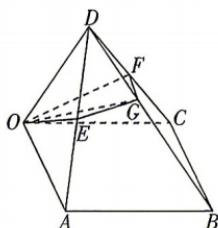

<!-- question-source:start -->
7.[河南信阳2026高二期中]如图,在四棱锥D-OABC中,底面OABC是平行四边形, $\angle AOC=\angle AOD=\angle COD=\frac{\pi}{3},OA=OC=OD=1,E$ 是AD

的中点， $F$ 是 $CD$ 的中点，过 $O,E,F$ 三点的平面与 $BD$ 相交于点 $G$ ，则 $OG =$ （）A. $\frac{\sqrt{5}}{2}$ B. $\frac{\sqrt{10}}{3}$ C. $\frac{2\sqrt{3}}{3}$ D. $\frac{\sqrt{11}}{3}$
<!-- question-source:end -->
