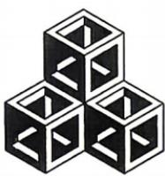
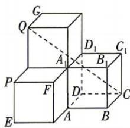

<!-- question-source:start -->
10.[重庆七校2026高二期中联考]布达佩斯的伊帕姆维泽蒂博物馆收藏的达·芬奇方砖在正六边形上画了具有视觉效果的正方体图案,如图①,把三片这样的达·芬奇方砖拼成图②的组合,这个组合再转换成图③所示的空间几何体.若图③中每个正方体的棱长为1,则下列结论正确的是()

  
图①

  
图②

  
图③

A. $\overrightarrow{CQ} +\overrightarrow{AB} = -\overrightarrow{AD} +2\overrightarrow{AA_1}$ B.点 $C_1$ 到直线 $CQ$ 的距离是 $\frac{\sqrt{5}}{3}$ C.直线 $CQ$ 与平面 $BC_{1}D$ 所成角的正弦值为 $\frac{5\sqrt{3}}{9}$ D.异面直线 $CQ$ 与 $BD$ 所成角的正切值为 $\sqrt{17}$
<!-- question-source:end -->
