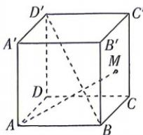

<!-- question-source:start -->
13.[山东济宁一中2025高二月考]如图所示,在正方体 $ABCD-A^{\prime}B^{\prime}C^{\prime}D^{\prime}$ 中,AB=3,M是侧面 $BCC^{\prime}B^{\prime}$ 内的动

点, 满足 $AM \perp BD'$ . 若 AM 与平面 $BCC'B'$ 所成的角为 $\theta$ , 则 $\tan \theta$ 的最大值为 \_\_\_\_.
<!-- question-source:end -->
