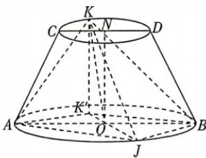

<!-- question-source:start -->
18. 新考法 创新载体（本小题满分 17 分）[内蒙古赤峰 2026 高二期中] 如图, 在圆台 NO 中, CD, AB 分别为上、下底面圆的直径, N, O 分别为上、下底面圆的圆心, AB = 2CD = 2ON = 4, AB // CD, K, J 分别为上、下底面圆周上的动点, 其中 J 异于 A, B, 点 K 在下底面的投影为点 $K'$ .

(1) 设 $KA = K'J = 3$ .

(i) 证明: $AB \perp OK$ ;

(ii) 求四棱锥 $K - AJBK'$ 的体积.

(2) 求二面角 K-AB-J 的正弦值的最小值.

<!-- question-source:end -->
