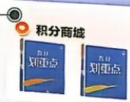
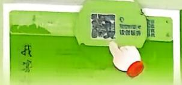
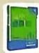
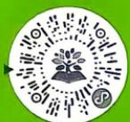
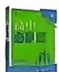
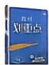
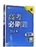
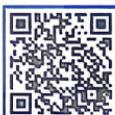
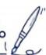

<!-- question-source:start -->
19. (本小题满分 17 分) [湖南多校 2025 高二联考] 若将任意平面向量 $\overrightarrow{EF} = (x, y)$ 绕其起点 $E$ 沿逆时针方向旋转 $\alpha$ 角, 得到向量 $\overrightarrow{EK} = (x\cos \alpha - y\sin \alpha, x\sin \alpha + y\cos \alpha)$ , 则称点 $F$ 绕点 $E$ 逆时针方向旋转 $\alpha$ 角得到点 $K$ . 曲线 $7x^{2} + 7y^{2} + 2xy = 96$ 是由椭圆 $C: \frac{y^{2}}{a^{2}} + \frac{x^{2}}{b^{2}} = 1 (a > b > 0)$ 在平面直角坐标系中绕原点 $O$ 逆时针旋转 $\frac{\pi}{4}$ 所得的斜椭圆 $\Omega$ .

(1) 求椭圆 C 的标准方程.

(2) 已知 $M, N$ 是椭圆 $C$ 长轴的两个顶点， $P, Q$ 为椭圆 $C$ 上异于 $M, N$ 且关于 $y$ 轴对称的两点。若直线 $MP$ 与直线 $NQ$ 交于点 $T$ ，证明点 $T$ 在某定曲线上，并求出该曲线的方程。

(3) 过椭圆 C 的上焦点作平行于 x 轴的直线 m，交椭圆 C 于 A, B 两点，D 是抛物线 $\Gamma: y = \frac{2}{9}x^{2}$ 上不同于点 A, B 的动点。若直线 DA 与椭圆 C 的另一个交点为 G，直线 DB 与椭圆 C 的另一个交点为 H，试问直线 HG 是否过定点？若是，求该定点的坐标；若不是，请说明理由。

群满或未通过：请至左侧资料库文档获取最新二维码

【温馨提示】本页为广告页，打印前可以把这页删掉

  
防失联渠道二：https://link3.cc/xbjf

请输入搜索的内容

本书增值扫码获取

  
更多>

  
语诗 一同学

# “理想树图书”专属【会员&增值】服务平台

理想树图书小程序
加入知识圈，解锁隐藏款福利\~

理想树App让你的手机变成AI学习机

## e 设前版

  
会员中心

## 微信扫图书封底上方二维码注册会员领福利

会员领券

  
当前成长值207，还差94成长值升级
v1 v2  
点击授权位置查看适用书店

周六抽奖

图书兑换

  
理想种树  
周六参与积分抽奖

  
种树获得积分  
错题本  
错题轻松录打印随心练

  
注册会员畅享更多

  
动书

  
图书增值  
图象

全学科知识总结与学法提炼

## 学讯

  
AI改作文  
推动公告
英语

  
正在阅读

  
AI提分

  
自测作业

  
错题本  
你的笔记值得炫耀！  
【VOA慢遞】具有敏锐洞察力的“局眼”  
我的书架一

600+本动态教辅书同步更新

## 动书

## 图书增值

全套资源，一键畅享

## AI赋能

AI驱动能力突破

  
2026学年 高中必刷题 数学

  
理想树图书

## 青藤计划·公益项目

## 青藤励学金

理想树与中国光华科技基金会共同发起“青藤计划”，设立百万专项基金，用于“青藤励学金”及“青藤讲堂”公益项目，善款由国家级4A基金会专业运作。

▶ 资助品正学优、覃思笃行的学子，护航前行的脚步，让每个梦想都有绽放的机会。

## 青藤讲堂

邀请科研院校专家学者，带来国防科技、航空航天、人工智能等前沿知识讲座。

邮箱地址：67book@lxzwedu.com若您有意报名“青藤计划”公益项目，请以学校为单位联系，我们将与您携手并肩，为每一个理想全力以赴。

联系电话：400-688-9167

[媒体号]

刷题小手 点点关注

小红书

@众望教育集团

@理想树-高中必刷题

  
扫码查看活动详情

## 活动专区

## 笔记开箱·知识超有料

每一页工整的笔记，都是你匠心独运的路线图；每一处高亮的标记，都闪烁着你知识的火花。

现在，我们诚挚邀请你，分享这份智慧结晶。参与【笔记争霸赛】，让你的笔记秘籍出道，知识的火花也是一种可以传递的力量！

## “信”有引力 〈信笺传意，字里共鸣 ——主编和你面对面〉

字是未谋面的心跳，信是跨山海的拥抱。无论是刷题感受、做题故事、习题疑问、改进建议，抑或是困惑、热望、小情绪……请让它乘着墨香，落进信笺，投给主编——让未谋面的心，在笔尖相遇。

见字如面，主编会珍视细读每一封来信，寄出专属回信。收信地址

北京市海淀区数码大厦A座9层 邮编：100080

@必刷题课代表

@必刷题课代表 试题网
www.stzy.com

@理想树图书必刷题官方

<!-- question-source:end -->
