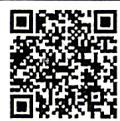
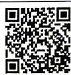

<!-- question-source:start -->
6. (多选) 已知 $x, y, z$ 为非零实数, 代数式 $\frac{x}{|x|} + \frac{y}{|y|} + \frac{z}{|z|} + \frac{|xyz|}{xyz}$ 的值所组成的集合是 $M$ , 则下列判断正确的是 ( )
A. $0 \notin M$ B. $2 \in M$ C. $-4 \in M$ D. $4 \in M$

注：2025 表示 2024\~2025 学年，2026 表示 2025\~2026 学年。

## 集合与常用逻辑用语

视频讲解
拍照批改

答案 P147
<!-- question-source:end -->

![[Q00070652A1]]
