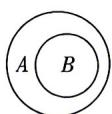
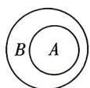
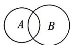
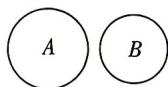

<!-- question-source:start -->
4. 设集合 $A = \left\{x \mid x = \frac{n}{2}, n \in \mathbf{Z}\right\}, B = \left\{x \mid x = n + \frac{1}{2}, n \in \mathbf{Z}\right\}$ , 则下列图形能表示 $A$ 与 $B$ 关系的是（）

A

B

C

D
<!-- question-source:end -->

![[Q00070670A1]]
