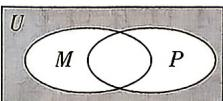
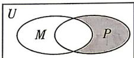
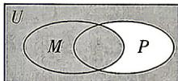
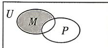

<!-- question-source:start -->
7.[陕西西安铁一中滨河学校2026高一月考]如图, $U$ 是全集, $M, P$ 是 $U$ 的子集, 则阴影部分所表示的集合是 $(\complement_U M) \cap (\complement_U P)$ 的是 ( )

A

B

答案 P150

C

D
<!-- question-source:end -->

![[Q00070696A1]]
