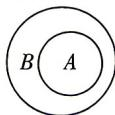

> [!faq]- 答案与解析
>
> > [!success]- **【答案】** BD
>
> > [!note]- **【解析】**
> > BD 【解析】空集是任何集合的子集, 是任何非空集合的真子集, 故选项 A 错误; 真子集具有传递性, 故选项 B 正确; 若一个集合是空集, 则没有真子集, 故选项 C 错误; 由 Venn 图易知选项 D 正确. 故选 BD.
> >
> > 
