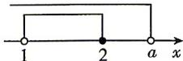

> [!faq]- 答案与解析
>
> > [!success]- **【答案】** B
>
> > [!note]- **【解析】**
> > B 【解析】因为 $A = \{x \mid 1 < x \leqslant 2\}$ ， $B = \{x \mid x < a\}$ ， $A \subseteq B$ ，所以 2 < a，故选 B.
> >
> > 
> >
> > 链接教材 本题是教材第9页习题1.2 第5题的变式,解此题需根据题中给出的包含关系列出不等式(组)求解参数范围.像这种连续的数集可借用数轴表示来帮助列式.注意集合端点,能取到为实心点,取不到为空心点.
> >
> > 刷易错 $\star$ 易错点1 混淆元素与集合、集合与集合之间的关系而致错
