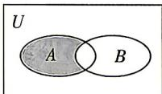

<!-- question-source:start -->
2. (多选) [浙江杭州 2026 高一期中] 下列集合表示图中阴影部分的为 ( )

A. $B\cup (\complement_UA)$ B. $A\cap (\complement_UB)$ C. $\complement_A(A\cap B)$ D. $\complement_{A\cup B}B$
<!-- question-source:end -->

![[Q00070703A1]]
