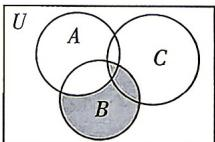
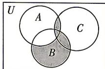
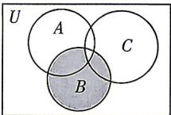
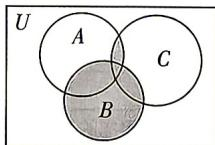

<!-- question-source:start -->
3.[陕西咸阳2026高一月考]已知集合A,B,C是全集U的三个子集,下图中的阴影部分能表示集合 $\left[\left(\complement_{U}A\right)\cap B\right]\cup(A\cap C)$ 的是()

A

B

C

D
<!-- question-source:end -->

![[Q00070714A1]]
