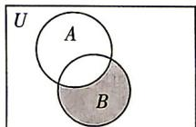
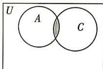
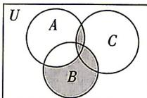

> [!faq]- 答案与解析
>
> > [!success]- **【答案】** B
>
> > [!note]- **【解析】**
> > B【解析】∵在Venn图中， $\complement_{U}A$ 表示长方形内圆A外的所有部分，
> > ∴ $(\complement_{U}A) \cap B$ 表示圆 B 内除去 $A \cap B$ 外的阴影部分，Venn 图表示为：
> >
> > 
> >
> > ∵ $A \cap C$ 表示圆 A 和圆 C 相交的阴影部分, Venn 图表示为:
> >
> > 
> >
> > ∴ $\left[\left(\complement_{U}A\right)\cap B\right]\cup(A\cap C)$ 表示上述两部分阴影的并集, Venn 图表示为:
> >
> > 
> >
> > ∴ 选项 B 中的阴影部分能表示集合 $\left[\left(\complement_{U}A\right)\cap B\right]\cup(A\cap C)$ . 故选 B.
> >
> > ## 刷难关
