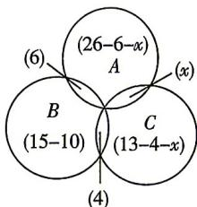

> [!faq]- 答案与解析
>
> > [!success]- **【答案】** B
>
> > [!note]- **【解析】**
> > B【解析】设参加数学、物理、化学小组的学生构成的集合分别为 $A,B,C$ ，同时参加数学和化学小组的有 $\pmb{x}$ 人，由题意可得如图所示的Venn图.
> >
> > 
> >
> > 因为全班共36名同学参加课外探究小组，所以 $(26 - 6 - x) + 6 + (15 - 10) + 4 + (13 - 4 - x) + x = 36$ ，解得 $x = 8$ ，即同时参加数学和化学小组的有8人.故选B.
> >
> > 二级结论 三个集合的“容斥原理”
> > card(A ∪ B ∪ C) = card(A) + card(B) +
> > card(C) - card(A ∩ B) - card(B ∩ C) -
> > card(A ∩ C) + card(A ∩ B ∩ C).
