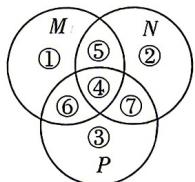

> [!faq]- 答案与解析
>
> > [!success]- **【答案】** D
>
> > [!note]- **【原始答案】** ABC
>
> > [!note]- **【解析】**
> > ABC 【解析】A 选项, 假设全集为 U, 由题意得 $M-N=M\cap(\complement_{U}N)$ , $N-M=N\cap(\complement_{U}M)$ , 所
> > 点悟: 将集合新定义运算转化为集合常规运算, 便于理解分析
> > 以 $M\Delta N = [M \cap (\complement_{U}N)] \cup [N \cap (\complement_{U}M)]$ , $N\Delta M=[N\cap(\complement_{U}M)]\cup[M\cap(\complement_{U}N)]$ ，所以 $M\Delta N=N\Delta M$ , A 正确.
> > 由题意, $M\Delta N$ 表示的运算为集合 M 与 N 的并集中去掉 M 与 N 的交集部分.
> > 不妨设 M, N, P 均有交集, 如图所示.
> >
> > 
> >
> > B 选项, $M\Delta N$ 表示①②⑥⑦部分的并集, $(M\Delta N)\Delta P$ 表示①②⑥⑦与③④⑥⑦的并集去掉两者的交集,
> > 即 $(M\Delta N)\Delta P$ 表示①②③④部分的并集, $N\Delta P$ 表示②③⑤⑥部分的并集, $M\Delta$ $(N\Delta P)$ 表示②③⑤⑥与①④⑤⑥的并集
> > 去掉两者的交集,
> > 即 $M\Delta(N\Delta P)$ 表示①②③④部分的并集,
> > 故 $(M\Delta N)\Delta P=M\Delta(N\Delta P)$ , B 正确.
> > C 选项,通过推理知 $M\cap(N\Delta P),(M\cap N)\Delta$ $(M\cap P)$ 均表示⑤⑥部分的并集,C 正确.
> > D 选项,通过推理得到 $M\cup(N\Delta P)$ 表示
> > - **①**：②③④⑤⑥部分的并集, $M\cup N$ 表示①②④⑤⑥⑦部分的并集, $M\cup P$ 表示①③④⑤⑥⑦部分的并集, $(M\cup N)\Delta(M\cup P)$ 表示①②④⑤⑥⑦与
> > - **①**：③④⑤⑥⑦的并集去掉两者的交集,
> > 即②③部分的并集,D 错误.
> >
> > 规律方法 对于 Venn 图, 若无法直接得到答案, 则可以拆分为互不相交的多个部分, 用编号区分每个部分, 再分析集合运算表示的是哪些部分.
