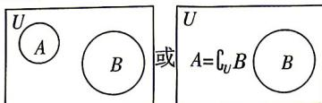

> [!faq]- 答案与解析
>
> > [!success]- **【答案】** A
>
> > [!note]- **【解析】**
> > (1)【证明】由性质②可得, 若 $x \in P$ , 则 $x + x = 2x \in P, x + 2x = 3x \in P$ .
> >
> > (2)【证明】由性质①, 可设 $x \in P, y \in P$ 且 $x > 0, y < 0$ , 即 $x$ 为正整数, -y 为正整数. 由性质②可知, $x$ 个 $y$ 相加属于集合 $P$ , 即 $xy \in P$ , 同理, -y 个 $x$ 相加也属于集合 $P$ , 即 $-yx \in P$ , 则 $0 = -yx + xy \in P$ .
> >
> > (3)【解】集合 $P$ 为无限集. 理由如下: 假设集合 $P$ 为有限集, 则集合 $P$ 中元素必
> >
> > \$\rightarrow\$ 黑板: 正难则反思想
> >
> > 有最大值, 且最大值为正整数, 不妨设最大值为 $m$ , 由性质②可得, $2m \in P$ , 又 $2m > m$ , 与集合 $P$ 中元素的最大值为 $m$ 矛盾, 所以集合 $P$ 为无限集.
> >
> > (2)集合法:根据使p,q成立的对象构成的集合之间的包含关系进行判断.满足p,q的元素构成的集合分别记作集合A,B,①若 $A\subsetneq B$ ,则p是q的充分不必要条件;
> > - **②**：若 $B\subsetneq A$ ,则p是q的必要不充分条件;
> > - **③**：若A=B,则p是q的充要条件.
> >
> > $$
> > A \subseteq \complement_ {U} B
> > $$
> >
> > 
> >
> > → 马思：集合间关系较为复杂不易直接分析充分、必要条件时，可画出 Venn 图，就会变得简单明了
> > 由图可知 B, C, D 错误，A 正确.
> >
> > 故选 **A**.
