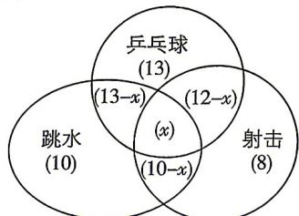

> [!faq]- 答案与解析
>
> > [!success]- **【答案】** 8
>
> > [!note]- **【解析】**
> > 如图,设该班同时喜欢乒乓球、跳水、射击比赛的同学有 x 名,
> >
> > 
> >
> > 则由图可得 $(13 - x) + (12 - x) + (10 - x) + x = 50 - 10 - 13 - 8$ ，解得 $x = 8$ 故该班同时喜欢乒乓球、跳水、射击比赛的同学有8名.
