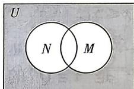

<!-- question-source:start -->
3.[北京北师大附中2025高一期中]设全集 $U =$ R,集合 $M = \{x\mid 0\leqslant x\leqslant 2\}$ ， $N = \{x\mid 1\leqslant x\leqslant 3\}$ ，如图所示，阴影部分所表示的集合为 （）

A. $\{x\mid x <   0$ 或 $x > 3\}$ B. $\{x\mid x\leqslant 0$ 或 $x\geqslant 3\}$ C. $\{x\mid x <   1$ 或 $x > 2\}$ D. $\{x\mid x\leqslant 1$ 或 $x\geqslant 2\}$
<!-- question-source:end -->

![[Q00070777A1]]
