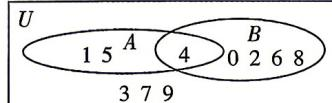

> [!faq]- 答案与解析
>
> > [!success]- **【答案】** BC
>
> > [!note]- **【解析】**
> > BC 【解析】因为 $U=\{x \mid x<10, x \in N\}$ ，
> > 所以 $U=\{0,1,2,3,4,5,6,7,8,9\}$ .
> > 因为 $A \cap (\complement_{U} B) = \{1, 5\}$ ，所以 $1, 5 \in A, 1, 5 \notin B$ .
> > 因为 $(\complement_{U}A)\cap(\complement_{U}B)=\{3,7,9\}=C_{U}(A\cup B)$ ,
> > 所以 $3,7,9\notin A,3,7,9\notin B.$ 又 $A \cap B = \{4\}$ ，所以 $4 \in A, 4 \in B.$ 综上，画出 Venn 图如图.
> >
> > 
> >
> > 对于 A, $8 \in B$ , 故 A 错误;
> > 对于 B, $\{5\} \subseteq A$ , 故 B 正确;
> > 对于 C, $7 \in \complement_{U}(A \cup B)$ , 故 C 正确;
> > 对于 D, A 的真子集个数为 $2^{3}-1=7$ , 故 D 错误.
> >
> > 故选 **BC**.
