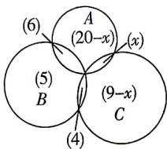

> [!faq]- 答案与解析
>
> > [!success]- **【答案】** 8
>
> > [!note]- **【解析】**
> > 设高一(1)班参加游泳、田径、球类比赛的学生分别构成集合A,B,C,设同时参加游泳和球类比赛的学生人数为x,则由题意作出Venn图如图,
> >
> > 
> >
> > 由题意可得 $20-x+6+x+5+4+9-x=36$ ，解得 x=8。因此同时参加游泳和球类比赛的学生有 8 人。
