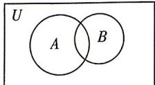

> [!faq]- 答案与解析
>
> > [!success]- **【答案】** A
>
> > [!note]- **【解析】**
> > 记 A, B 分别为调查的含聚酯纤维、天然纤维的服装组成的集合，全集 U 为调查的 100 种服装，则 $\text{card}(U)=100, \text{card}(A)=72, \text{card}(B)=54$ . 作出 Venn 图如图.
> >
> > 
> >
> > 由 $\operatorname{card}(A \cup B) = \operatorname{card}(A) + \operatorname{card}(B) - \operatorname{card}(A \cap B)$ 知， $\operatorname{card}(A \cap B) = \operatorname{card}(A) + \operatorname{card}(B) - \operatorname{card}(A \cup B) = 126 - \operatorname{card}(A \cup B)$ ，因为 $A \cup B \subseteq U$ ，所以 $\operatorname{card}(A \cup B) \leqslant \operatorname{card}(U) = 100$ ，所以 $\operatorname{card}(A \cap B) \geqslant 126 - 100 = 26.$ 又 $A \cap B \subseteq A, A \cap B \subseteq B$ ，故 $\operatorname{card}(A \cap B) \leqslant \operatorname{card}(A) = 72, \operatorname{card}(A \cap B) \leqslant \operatorname{card}(B) = 54$ ，所以 $\operatorname{card}(A \cap B) \leqslant 54.$ 综上可知， $26 \leqslant \operatorname{card}(A \cap B) \leqslant 54$ ，因此，由这两种纤维混纺的服装最多有54种，最少有26种.
