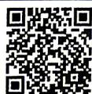

## 2.1 等式性质与不等式性质

视频讲解

拍照批改

## 刷基础

## 题型1 不等关系的建立

![[高中/课堂同步/教辅/必刷题/2027版 高中必刷题数学必修第一册RJA/02_第二章_一元二次函数_方程和不等式/2_1_等式性质与不等式性质/questions/Q00070816.md]]
![[高中/课堂同步/教辅/必刷题/2027版 高中必刷题数学必修第一册RJA/02_第二章_一元二次函数_方程和不等式/2_1_等式性质与不等式性质/questions/Q00070817.md]]
![[高中/课堂同步/教辅/必刷题/2027版 高中必刷题数学必修第一册RJA/02_第二章_一元二次函数_方程和不等式/2_1_等式性质与不等式性质/questions/Q00070818.md]]
![[高中/课堂同步/教辅/必刷题/2027版 高中必刷题数学必修第一册RJA/02_第二章_一元二次函数_方程和不等式/2_1_等式性质与不等式性质/questions/Q00070819.md]]
![[高中/课堂同步/教辅/必刷题/2027版 高中必刷题数学必修第一册RJA/02_第二章_一元二次函数_方程和不等式/2_1_等式性质与不等式性质/questions/Q00070820.md]]
![[高中/课堂同步/教辅/必刷题/2027版 高中必刷题数学必修第一册RJA/02_第二章_一元二次函数_方程和不等式/2_1_等式性质与不等式性质/questions/Q00070821.md]]
![[高中/课堂同步/教辅/必刷题/2027版 高中必刷题数学必修第一册RJA/02_第二章_一元二次函数_方程和不等式/2_1_等式性质与不等式性质/questions/Q00070822.md]]
![[高中/课堂同步/教辅/必刷题/2027版 高中必刷题数学必修第一册RJA/02_第二章_一元二次函数_方程和不等式/2_1_等式性质与不等式性质/questions/Q00070823.md]]
![[高中/课堂同步/教辅/必刷题/2027版 高中必刷题数学必修第一册RJA/02_第二章_一元二次函数_方程和不等式/2_1_等式性质与不等式性质/questions/Q00070824.md]]
![[高中/课堂同步/教辅/必刷题/2027版 高中必刷题数学必修第一册RJA/02_第二章_一元二次函数_方程和不等式/2_1_等式性质与不等式性质/questions/Q00070825.md]]
![[高中/课堂同步/教辅/必刷题/2027版 高中必刷题数学必修第一册RJA/02_第二章_一元二次函数_方程和不等式/2_1_等式性质与不等式性质/questions/Q00070826.md]]
![[高中/课堂同步/教辅/必刷题/2027版 高中必刷题数学必修第一册RJA/02_第二章_一元二次函数_方程和不等式/2_1_等式性质与不等式性质/questions/Q00070827.md]]
![[高中/课堂同步/教辅/必刷题/2027版 高中必刷题数学必修第一册RJA/02_第二章_一元二次函数_方程和不等式/2_1_等式性质与不等式性质/questions/Q00070828.md]]
![[高中/课堂同步/教辅/必刷题/2027版 高中必刷题数学必修第一册RJA/02_第二章_一元二次函数_方程和不等式/2_1_等式性质与不等式性质/questions/Q00070829.md]]
![[高中/课堂同步/教辅/必刷题/2027版 高中必刷题数学必修第一册RJA/02_第二章_一元二次函数_方程和不等式/2_1_等式性质与不等式性质/questions/Q00070830.md]]
![[高中/课堂同步/教辅/必刷题/2027版 高中必刷题数学必修第一册RJA/02_第二章_一元二次函数_方程和不等式/2_1_等式性质与不等式性质/questions/Q00070831.md]]
![[高中/课堂同步/教辅/必刷题/2027版 高中必刷题数学必修第一册RJA/02_第二章_一元二次函数_方程和不等式/2_1_等式性质与不等式性质/questions/Q00070832.md]]
![[高中/课堂同步/教辅/必刷题/2027版 高中必刷题数学必修第一册RJA/02_第二章_一元二次函数_方程和不等式/2_1_等式性质与不等式性质/questions/Q00070833.md]]
![[高中/课堂同步/教辅/必刷题/2027版 高中必刷题数学必修第一册RJA/02_第二章_一元二次函数_方程和不等式/2_1_等式性质与不等式性质/questions/Q00070834.md]]
![[高中/课堂同步/教辅/必刷题/2027版 高中必刷题数学必修第一册RJA/02_第二章_一元二次函数_方程和不等式/2_1_等式性质与不等式性质/questions/Q00070835.md]]
