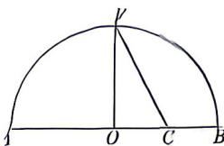

<!-- question-source:start -->
1.[广东佛山2026高一月考]《几何原本》卷2的几何代数法(以几何方法研究代数问题)成了后来西方数学家处理问题的重要依据.通过这一原理,很多代数的基本事实或定理都能够通过图形实现证明,也称之为无字证明,现有如图所示图形,点F在半圆O上,点C在直径AB上,且 $OF\perp AB$ ,设AC=a,BC=b,则该图形可以完成的无字证明为()

A. $\frac{a + b}{2} >\sqrt{ab}$ $(a > b > 0)$ B. $a^1 +b^1 >2ab(a > b > 0)$ C. $\frac{2ab}{a + b} <  \sqrt{ab}$ $(a > b > 0)$ D. $\frac{a + b}{2} <  \sqrt{\frac{a^1 + b^1}{2}} (a > b > 0)$

<!-- question-source:end -->

![[Q00070854A1]]
