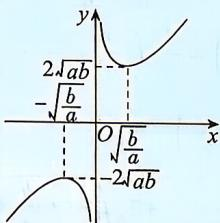

> [!faq]- 答案与解析
>
> > [!success]- **【答案】** C
>
> > [!note]- **【解析】**
> > C 【解析】A 项, $y = \sqrt{x^2 + 4} + \frac{1}{\sqrt{x^2 + 4}} \geqslant 2\sqrt{\sqrt{x^2 + 4} \cdot \frac{1}{\sqrt{x^2 + 4}}} = 2$ , 当且仅当 $\sqrt{x^2 + 4} = \frac{1}{\sqrt{x^2 + 4}}$ , 即 $x^2 + 4 = 1$ 时, 等号成立, 但方程 $x^2 + 4 = 1$ 无解, 故等号取不到, 即最小值必大于 2, 故 A 错误; B 项, 当 $a > 0, b < 0$ 时, $\frac{b}{a} < 0, \frac{a}{b} < 0$ , 则 $\frac{b}{a} + \frac{a}{b} < 0$ , 故 B 错误; C 项, 当 $a = -2$ 时, $a + \frac{1}{a} = -\frac{5}{2} \leqslant -2$ , 即存在 $a$ , 使得 $a + \frac{1}{a} \leqslant -2$ 成立, 故 C 正确; D 项, 易知当 $0 < x < \frac{4}{3}$ 时, $y$ 取得最大值, 则 $y = x(4 - 3x) = \frac{1}{3} \cdot 3x(4 - 3x) \leqslant \frac{1}{3}\left[\frac{3x + (4 - 3x)}{2}\right]^2 = \frac{4}{3}$ , 当且仅当 $3x = 4 - 3x$ , 即 $x = \frac{2}{3}$ 时取等号, 则 $y_{\max} = \frac{4}{3}$ , 故 D 错误. 故选 C.
> >
> > 易错警示 注意使用基本不等式的条件:“一正、二定、三相等”,不是正数时可以提出负号转化为正数,不是定值的时候可以通过配凑转化为定值,不能取等时往往需要转化为对勾函数解决.
> > 对勾函数 $y=ax+\frac{b}{x}(a>0,b>0)$ 的图象如图所示,取不到等号时可结合函数图象求最值.
> >
> > 
> >
> > ★易错点3 多次应用基本不等式而致错
