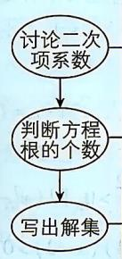

> [!faq]- 答案与解析
>
> > [!success]- **【答案】** A
>
> > [!note]- **【解析】**
> > A 【解析】当 $a > 0$ 时，不等式的解集为 $\{x\mid x < -1$ 或 $x > a\}$ 当 $a < 0$ 时，若 $-1 < a$ ，则不等式的解集为 $\{x\mid -1 < x < a\}$
> >
> > 对于C:令 $x+2=a(a\geqslant2)$ , $y+1=b(b\geqslant1)$ ，则 $a+b=x+y+3=4$ ，
> > 则 $\frac{x^{2}}{x+2}+\frac{y^{2}}{y+1}=\frac{(a-2)^{2}}{a}+\frac{(b-1)^{2}}{b}=a+\frac{4}{a}-4+b+\frac{1}{b}-2=a+b-6+\frac{4}{a}+\frac{1}{b}=-2+\frac{1}{4}(a+b)\cdot\left(\frac{4}{a}+\frac{1}{b}\right)=-2+\frac{1}{4}\left(5+\frac{4b}{a}+\frac{a}{b}\right)\geqslant\frac{1}{4}$ ，当且仅当a=2b，即 $x=\frac{2}{3}$ ， $y=\frac{1}{3}$ 时，等号成立，则 $\frac{x^{2}}{x+2}+\frac{y^{2}}{y+1}$ 的最小值为 $\frac{1}{4}$ ，故
> >
> > ## 2.3 二次函数与一元二次方程、不等式
> >
> > 若 $a = -1$ ，则不等式即为 $-(x + 1)^2 >0$ ，此时不等式的解集为 $\varnothing$ 若 $a < -1$ ，则不等式的解集为 $\{x\mid a < x < -1\}$ 综上所述，不等式的解集可能为BCD，不可能为A.故选A.
> >
> > ## 归纳总结 解含参数的一元二次型不等式的步骤
> >
> > <table><tr><td rowspan="3"></td><td>系数若含有参数应讨论它是等于0,小于0,还是大于0,然后将不等式转化为二次项系数为正的形式</td></tr><tr><td>讨论判别式Δ与0的关系,判断方程的根的个数</td></tr><tr><td>确定无根时可直接写出解集,确定方程有两个根时,需讨论两根的大小关系,从而确定解集</td></tr></table>
