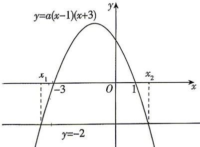

> [!faq]- 答案与解析
>
> > [!success]- **【答案】** ACD
>
> > [!note]- **【解析】**
> > ACD 【解析】由题设, 不等式 $a(x-1)$ , $(x+3)+2>0$ , 即 $ax^2+2ax-3a+2>0$ 的解为 $x_1<x<x_2$ , $\therefore a<0$ , 则 $\left\{\begin{aligned} x_1+x_2 & = -2, \\ x_1x_2 & = \frac{2}{a}-3<0, \end{aligned}\right.$ $\therefore x_1+x_2+2=0, x_1x_2+3=\frac{2}{a}<0$ , 则 A, D 正确; 原不等式可化为 $a(x-1)(x+3)>-2$ , 令 $y=a(x-1)(x+3)$ , 由题意可知函数图象开口向下, 与 $x$ 轴两交点的横坐标分别为 -3 和 1, 与直线 $y=-2$ 两交点的横坐标分别为 $x_1, x_2$ , 且 $x_1<x_2$ , 作出大致图象如图所示, $\therefore$ 由图知 $x_1<-3<1<x_2, |x_1-x_2|>4$ , 故 B 错误, C 正确. 故选 ACD.
> >
> > 
