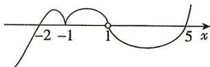

> [!faq]- 答案与解析
>
> > [!success]- **【答案】** $\{x \mid x \leqslant -2 \text{ 或 } x = -1 \text{ 或 } 1 < x \leqslant 5\}$
>
> > [!note]- **【解析】**
> > 因为 $\frac{(x+1)^{2}(5-x)(x+2)^{3}}{(x-1)^{5}} \geqslant 0,$ 所以 $\left\{\begin{aligned}(x+1)^{2}(5-x)(x+2)^{3}(x-1)^{5} &\geqslant 0,\\ (x-1)^{5} &\neq 0,\end{aligned}\right.$ 即 $\left\{\begin{aligned}(x+1)^{2}(x-5)(x+2)^{3}(x-1)^{5} &\leqslant 0,\\ (x-1)^{5} &\neq 0.\end{aligned}\right.$ 令 $(x+1)^{2}(x-5)(x+2)^{3}(x-1)^{5}=0,$ 解得 $x_{1}=x_{2}=x_{3}=-2, x_{4}=x_{5}=-1, x_{6}=x_{7}=x_{8}=$ $x_{9}=x_{10}=1, x_{11}=5,$ 采用“穿针引线法”，如图所示，
> >
> > 
> >
> > 由图可得原不等式的解集为 $\{x \mid x \leqslant -2$ 或 $x = -1$ 或 $1 < x \leqslant 5\}$ .
> >
> > 归纳总结 对于高次不等式可利用“穿针引线法”进行求解,求解的步骤如下:(1)对不等式进行移项并分解因式,使得不等式右侧为0且左侧每个因式中x的系数为正,例如本题中5-x需化为x-5;
> >
> > (2) 解出不等式对应方程的所有根并在数轴上依次标出；
> > (3) 以数轴为标准, 从最右根的右上方往左下方画线, 依据“奇穿偶不穿”的原则依次穿过各根;
> > (4) 根据不等号方向选取 x 轴上方或 x 轴下方的部分(注意在 x 轴上的点的选取), 即可得出不等式的解集.
