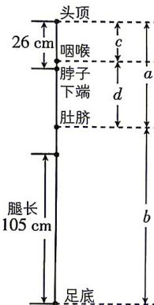

> [!faq]- 答案与解析
>
> > [!success]- **【答案】** B
>
> > [!note]- **【解析】**
> > B 【解析】如图, 设 “某人”头顶至肚脐的长度为 a cm, 肚脐至足底的长度为 b cm, 头顶至咽喉的长度为 c cm, 咽喉至肚脐的长度为 d cm, 则 $\frac{a}{b} = \frac{c}{d} = \frac{\sqrt{5} - 1}{2} \approx 0.618$ , c < 26, b > 105, c + d = a.
> >
> > 
