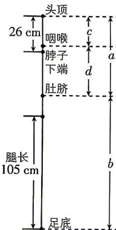

> [!faq]- 答案与解析
>
> > [!success]- **【答案】** B
>
> > [!note]- **【解析】**
> > B 【解析】如图, 设 “某人”头顶至肚脐的长度为 a cm, 肚脐至足底的长度为 b cm, 头顶至咽喉的长度为 c cm, 咽喉至肚脐的长度为 d cm, 则 $\frac{a}{b} = \frac{c}{d} = \frac{\sqrt{5} - 1}{2} \approx 0.618$ , c < 26, b > 105, c + d = a.
> >
> > 
> >
> > 设“某人”的身高为h cm, 即 a+b=h.
> > 由 $\left\{\begin{aligned}&b>105,\\ &a\approx0.618b,\end{aligned}\right.$ 解得 a>64.89,
> > 由 $\left\{\begin{aligned}&c<26,\\ &c\approx0.618d,\end{aligned}\right.$ 解得 d<42.07,
> > 所以 $c+d<26+42.07=68.07$ , 即 a<68.07. $\left\{\begin{aligned}&a<68.07,\\ &a\approx0.618b,\end{aligned}\right.$ 解得 b<110.15.
> > 整理可得 $64.89 + 105 < a + b < 68.07 + 110.15$ , 即 $169.89 < h < 178.22$ , 结合选项可知其身高可能是 175 cm. 故选 B.
> > 多种解法 若以 26 cm 为头顶到咽喉的长度，则身高为 $\left(26+26\times\frac{2}{\sqrt{5}-1}\right)\times\left(1+\frac{2}{\sqrt{5}-1}\right)=26\times\left(1+\frac{\sqrt{5}+1}{2}\right)^{2}\approx178(\text{cm})$ .
> > 若以 105 cm 为肚脐到足底的长度，则身高为 $105 \times \left(1 + \frac{\sqrt{5} - 1}{2}\right) = 105 \times \frac{\sqrt{5} + 1}{2} \approx 170(\text{cm})$ . 结合选项可知其身高可能是 175 cm.
> >
> > 故选 **B**.
