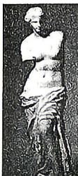

<!-- question-source:start -->
1.[课标全国Ⅰ理2019·4,5分]古希腊时期，人们认为最美人体的头顶至肚脐的长度与肚脐至足底的长度之比是 $\frac{\sqrt{5} - 1}{2}\left(\frac{\sqrt{5} - 1}{2}\approx\right.$

0.618,称为黄金分割比例),著名的“断臂维纳斯”便是如此.此外,最美人体的头顶至咽喉的长度与咽喉至肚脐的长度之比也是 $\frac{\sqrt{5}-1}{2}$ .若某人满

足上述两个黄金分割比例,且腿长为 $105 \, cm$ , 头顶至脖子下端的长度为 $26 \, cm$ , 则其身高可能是 ( )
A. $165 \, cm$ B. $175 \, cm$ C. $185 \, cm$ D. $190 \, cm$

## 考点2 基本不等式的应用
<!-- question-source:end -->

![[Q00070929A1]]
