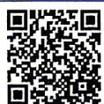

## 3.1.1 函数的概念

视频讲解

拍照批改

## 刷基础

## 题型 1 函数定义的理解

![[高中/课堂同步/教辅/必刷题/2027版 高中必刷题数学必修第一册RJA/03_第三章_函数的概念与性质/3_1_1_函数的概念/questions/Q00070938.md]]
![[高中/课堂同步/教辅/必刷题/2027版 高中必刷题数学必修第一册RJA/03_第三章_函数的概念与性质/3_1_1_函数的概念/questions/Q00070939.md]]
![[高中/课堂同步/教辅/必刷题/2027版 高中必刷题数学必修第一册RJA/03_第三章_函数的概念与性质/3_1_1_函数的概念/questions/Q00070940.md]]
![[高中/课堂同步/教辅/必刷题/2027版 高中必刷题数学必修第一册RJA/03_第三章_函数的概念与性质/3_1_1_函数的概念/questions/Q00070941.md]]
![[高中/课堂同步/教辅/必刷题/2027版 高中必刷题数学必修第一册RJA/03_第三章_函数的概念与性质/3_1_1_函数的概念/questions/Q00070942.md]]
![[高中/课堂同步/教辅/必刷题/2027版 高中必刷题数学必修第一册RJA/03_第三章_函数的概念与性质/3_1_1_函数的概念/questions/Q00070943.md]]
![[高中/课堂同步/教辅/必刷题/2027版 高中必刷题数学必修第一册RJA/03_第三章_函数的概念与性质/3_1_1_函数的概念/questions/Q00070944.md]]
![[高中/课堂同步/教辅/必刷题/2027版 高中必刷题数学必修第一册RJA/03_第三章_函数的概念与性质/3_1_1_函数的概念/questions/Q00070945.md]]
![[高中/课堂同步/教辅/必刷题/2027版 高中必刷题数学必修第一册RJA/03_第三章_函数的概念与性质/3_1_1_函数的概念/questions/Q00070946.md]]
![[高中/课堂同步/教辅/必刷题/2027版 高中必刷题数学必修第一册RJA/03_第三章_函数的概念与性质/3_1_1_函数的概念/questions/Q00070947.md]]
![[高中/课堂同步/教辅/必刷题/2027版 高中必刷题数学必修第一册RJA/03_第三章_函数的概念与性质/3_1_1_函数的概念/questions/Q00070948.md]]
![[高中/课堂同步/教辅/必刷题/2027版 高中必刷题数学必修第一册RJA/03_第三章_函数的概念与性质/3_1_1_函数的概念/questions/Q00070949.md]]
![[高中/课堂同步/教辅/必刷题/2027版 高中必刷题数学必修第一册RJA/03_第三章_函数的概念与性质/3_1_1_函数的概念/questions/Q00070950.md]]
![[高中/课堂同步/教辅/必刷题/2027版 高中必刷题数学必修第一册RJA/03_第三章_函数的概念与性质/3_1_1_函数的概念/questions/Q00070951.md]]
![[高中/课堂同步/教辅/必刷题/2027版 高中必刷题数学必修第一册RJA/03_第三章_函数的概念与性质/3_1_1_函数的概念/questions/Q00070952.md]]
![[高中/课堂同步/教辅/必刷题/2027版 高中必刷题数学必修第一册RJA/03_第三章_函数的概念与性质/3_1_1_函数的概念/questions/Q00070953.md]]
![[高中/课堂同步/教辅/必刷题/2027版 高中必刷题数学必修第一册RJA/03_第三章_函数的概念与性质/3_1_1_函数的概念/questions/Q00070954.md]]
![[高中/课堂同步/教辅/必刷题/2027版 高中必刷题数学必修第一册RJA/03_第三章_函数的概念与性质/3_1_1_函数的概念/questions/Q00070955.md]]
![[高中/课堂同步/教辅/必刷题/2027版 高中必刷题数学必修第一册RJA/03_第三章_函数的概念与性质/3_1_1_函数的概念/questions/Q00070956.md]]
![[高中/课堂同步/教辅/必刷题/2027版 高中必刷题数学必修第一册RJA/03_第三章_函数的概念与性质/3_1_1_函数的概念/questions/Q00070957.md]]
![[高中/课堂同步/教辅/必刷题/2027版 高中必刷题数学必修第一册RJA/03_第三章_函数的概念与性质/3_1_1_函数的概念/questions/Q00070958.md]]
![[高中/课堂同步/教辅/必刷题/2027版 高中必刷题数学必修第一册RJA/03_第三章_函数的概念与性质/3_1_1_函数的概念/questions/Q00070959.md]]
![[高中/课堂同步/教辅/必刷题/2027版 高中必刷题数学必修第一册RJA/03_第三章_函数的概念与性质/3_1_1_函数的概念/questions/Q00070960.md]]
![[高中/课堂同步/教辅/必刷题/2027版 高中必刷题数学必修第一册RJA/03_第三章_函数的概念与性质/3_1_1_函数的概念/questions/Q00070961.md]]
![[高中/课堂同步/教辅/必刷题/2027版 高中必刷题数学必修第一册RJA/03_第三章_函数的概念与性质/3_1_1_函数的概念/questions/Q00070962.md]]
![[高中/课堂同步/教辅/必刷题/2027版 高中必刷题数学必修第一册RJA/03_第三章_函数的概念与性质/3_1_1_函数的概念/questions/Q00070963.md]]
![[高中/课堂同步/教辅/必刷题/2027版 高中必刷题数学必修第一册RJA/03_第三章_函数的概念与性质/3_1_1_函数的概念/questions/Q00070964.md]]
![[高中/课堂同步/教辅/必刷题/2027版 高中必刷题数学必修第一册RJA/03_第三章_函数的概念与性质/3_1_1_函数的概念/questions/Q00070965.md]]
![[高中/课堂同步/教辅/必刷题/2027版 高中必刷题数学必修第一册RJA/03_第三章_函数的概念与性质/3_1_1_函数的概念/questions/Q00070966.md]]
![[高中/课堂同步/教辅/必刷题/2027版 高中必刷题数学必修第一册RJA/03_第三章_函数的概念与性质/3_1_1_函数的概念/questions/Q00070967.md]]
![[高中/课堂同步/教辅/必刷题/2027版 高中必刷题数学必修第一册RJA/03_第三章_函数的概念与性质/3_1_1_函数的概念/questions/Q00070968.md]]
![[高中/课堂同步/教辅/必刷题/2027版 高中必刷题数学必修第一册RJA/03_第三章_函数的概念与性质/3_1_1_函数的概念/questions/Q00070969.md]]
![[高中/课堂同步/教辅/必刷题/2027版 高中必刷题数学必修第一册RJA/03_第三章_函数的概念与性质/3_1_1_函数的概念/questions/Q00070970.md]]
