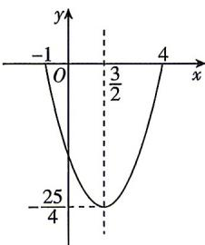

> [!faq]- 答案与解析
>
> > [!success]- **【答案】** B
>
> > [!note]- **【解析】**
> > B 【解析】结合题意, 函数 $y = x^{2} - 3x - 4 = \left(x - \frac{3}{2}\right)^{2} - \frac{25}{4}$ 的图象是开口向上的抛物线, 其对称轴方程为 $x = \frac{3}{2}$ , 如图, $f\left(\frac{3}{2}\right) = -\frac{25}{4}$ , 易知 $f(-1) = f(4) = 0$ , 由图可知, 要使函数 $y = x^{2} - 3x - 4$ 的定义域是 $[-1, m]$ , 值域为 $\left[-\frac{25}{4}, 0\right]$ , 则实数 m 的取值范围是 $\left[\frac{3}{2}, 4\right]$ . 故选 B.
> >
> > 
