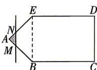

<!-- question-source:start -->
4.[湖南邵阳2026高一月考]如图,四边形BCDE是矩形,BC=8,CD=6, $\triangle ABE$ 是等腰直角三在数学的领域中,提出问题的艺术比解答问题的艺术更为重要。

答案 P176

角形. 点 $M$ 从点 $A$ 出发, 沿着边 $AB, BC$ 运动到点 $C$ , 点 $N$ 在边 $AE, ED$ 上运动, 直线 $MN \parallel CD$ . 设点 $M$ 运动的路程为 $x, MN$ 的左侧部分的多边形的周长 (含线段 $MN$ 的长度) 为 $L(x)$ . 当点 $M$ 在线段 $BC$ 上运动时, $L(x)$ 的解析式为 ( )

A. $L(x) = 2x + 6(3\sqrt{2} \leqslant x \leqslant 3\sqrt{2} + 8)$ B. $L(x) = 2x + 6(0 \leqslant x \leqslant 8)$ C. $L(x) = 2x + 6\sqrt{2} + 6(3\sqrt{2} \leqslant x \leqslant 3\sqrt{2} + 8)$ D. $L(x) = 2x + 6\sqrt{2}(0 \leqslant x \leqslant 8)$
<!-- question-source:end -->

![[Q00070972A1]]
