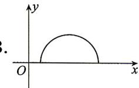

<!-- question-source:start -->
1. 以下形式中,不能表示 y 是 x 的函数的是 ( )

<table><tr><td>x</td><td>1</td><td>2</td><td>3</td><td>4</td></tr><tr><td>y</td><td>4</td><td>3</td><td>2</td><td>1</td></tr></table>

$$
y = x ^ {2}
$$

D. $(x + y)(x - y) = 0$
<!-- question-source:end -->

![[Q00070984A1]]
