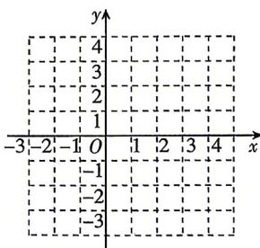

<!-- question-source:start -->
8.[安徽淮北2026高一期中]已知函数 $f(x)=\left\{\begin{aligned}&\frac{1}{x},-1\leqslant x<0,\\&x^{2}-2x,0\leqslant x\leqslant3,\\&-2x+9,3<x\leqslant4.\end{aligned}\right.$

(1) 求 $f(4)$ , $f(f(1))$ 的值;
(2) 若 $f(a)=1$ , 求 a 的值;

(3)在给定的坐标系中画出函数 $f(x)$ 的图象，并根据图象写出函数 $f(x)$ 的值域（无需写出理由）.

## 刷素养
<!-- question-source:end -->

![[Q00070991A1]]
