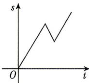
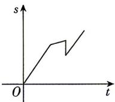
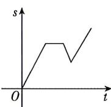
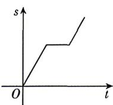

<!-- question-source:start -->
2.[河南漯河高中2026高一月考]周末某同学到漯湾古镇游玩,他骑行共享单车匀速由学校前往,前进a km,疲惫不堪,休息半小时后,沿原路返回,归途中又觉得不能半途而废,便调转车头继续向漯湾古镇方向前进,则该同学离起点(学校)的距离s与时间t的函数图象大致为()

A

B

C

D
<!-- question-source:end -->

![[Q00070994A1]]
