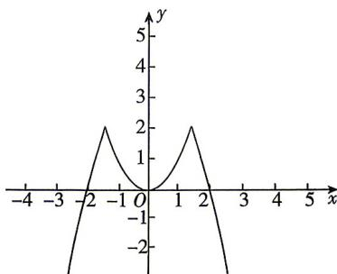

> [!faq]- 答案与解析
>
> > [!success]- **【答案】** ABD
>
> > [!note]- **【解析】**
> > ABD 【解析】当 $4-x^{2} \leqslant x^{2}$ ，即 $x \leqslant -\sqrt{2}$ 或 $x \geqslant \sqrt{2}$ 时， $F(x) = 4 - x^{2}$ ，
> > 当 $4-x^{2}>x^{2}$ ，即 $-\sqrt{2}<x<\sqrt{2}$ 时， $F(x)=x^{2}$ ，
> > 则 $F(x)=\left\{\begin{aligned}&4-x^{2},&x\geqslant\sqrt{2}\text{或}x\leqslant-\sqrt{2},\\ &x^{2},&-\sqrt{2}<x<\sqrt{2}.\\\end{aligned}\right.$ 画出函数 $F(x)$ 的图象如图所示.
> >
> > 
> >
> > 点悟：本质就是取较小的函数值，体现在函数图象上就是图象取不在另一个函数图象上方的部分即可
> > 对于 A, $F(1)=1$ , $F(-1)=1$ , 故 A 正确；
> > 对于 B, 当 $x \leqslant -\sqrt{2}$ 或 $x \geqslant \sqrt{2}$ 时, 令 $F(x) = 4 - x^{2} = 0$ , 解得 $x = \pm 2$ .
> >
> > 当 $-\sqrt{2}<x<\sqrt{2}$ 时，令 $F(x)=x^{2}=0$ ，解得x=0，则方程 $F(x)=0$ 有三个解，故B正确；
> > 对于 C, 当 $x \leqslant -\sqrt{2}$ 或 $x \geqslant \sqrt{2}$ 时，令 $F(x)=4-x^{2}>0$ ，解得 $-2<x \leqslant -\sqrt{2}$ 或 $\sqrt{2} \leqslant x < 2$ .
> > 当 $-\sqrt{2}<x<\sqrt{2}$ 时，令 $F(x)=x^{2}>0$ ，解得 $-\sqrt{2}<x<0$ 或 $0<x<\sqrt{2}$ .
> > 综上所述，当 $F(x)>0$ 时，有 $x \in (-2, 0) \cup (0, 2)$ ，故 C 错误；
> > 对于 D, 当 $x \leqslant -\sqrt{2}$ 或 $x \geqslant \sqrt{2}$ 时， $F(x)=4-x^{2} \leqslant 2$ ，无最小值.
> > 当 $-\sqrt{2}<x<\sqrt{2}$ 时， $0 \leqslant F(x)=x^{2}<2.$ 综上，函数 $F(x)$ 有最大值为 2，无最小值，
> > 故 D 正确.
> >
> > 故选 **ABD**.
