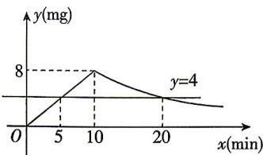

> [!faq]- 答案与解析
>
> > [!success]- **【答案】** C
>
> > [!note]- **【解析】**
> > C 【解析】当 $0 \leqslant x \leqslant 10$ 时，设 $y = kx (k \neq 0)$ ，将点（10,8）的坐标代入 $y = kx$ 中得 $10k = 8$ ，解得 $k = \frac{4}{5}$ ，所以 $y = \frac{4}{5}x$ . 当 $x > 10$ 时，设 $y = \frac{a}{x} (a \neq 0)$ ，将点（10,8）的坐标代入 $y = \frac{a}{x}$ 中得 $a = 10 \times 8 = 80$ ，所以 $y = \frac{80}{x}$ . 综上， $y = \begin{cases} \frac{4}{5}x, & 0 \leqslant x \leqslant 10, \\ \frac{80}{x}, & x > 10. \end{cases}$ 当 $0 \leqslant x \leqslant 10$ 时，令 $\frac{4}{5}x = 4$ ，解得 $x = 5$ ；当 $x > 10$ 时，令 $\frac{80}{x} = 4$ ，解得 $x = 20$ . 则当 $y \geqslant 4$ 时， $5 \leqslant x \leqslant 20$ ，所以此次消毒的有效时间是 $20 - 5 = 15 (\min)$ ，故选 C.
> >
> > 
