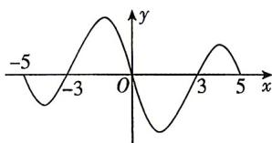

> [!faq]- 答案与解析
>
> > [!success]- **【答案】** B
>
> > [!note]- **【解析】**
> > B 【解析】因为函数 $f(x)$ 是奇函数, 所以 $y=f(x)$ 在 $[-5,5]$ 上的图象关于坐标原点对称, 由 $y=f(x)$ 在 $[0,5]$ 上的图象, 知它在 $[-5,0]$ 上的图象, 如图所示.
> >
> > 
> >
> > 所以由图可知使 $f(x)<0$ 的x的取值范围为 $(-5,-3)\cup(0,3)$ .
> >
> > 故选 **B**.
