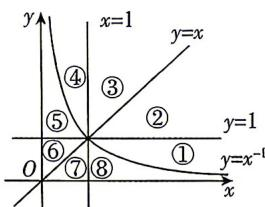

<!-- question-source:start -->
6. 直线 y=1, y=x, x=1 及幂函数 $y=x^{-1}$ 的图象将直角坐标系第一象限分为 8 个部分（如图所示），那么幂函数 $y=x^{-\frac{1}{3}}$ 的图象在第一象限中经过（）

视频讲解
拍照批改

答案 P188

A. $③⑦$ B. $⑤⑧$ C. $①④$ D. $①⑤$
<!-- question-source:end -->

![[Q00071091A1]]
