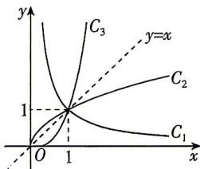

> [!faq]- 答案与解析
>
> > [!success]- **【答案】** D
>
> > [!note]- **【解析】**
> > D【解析】记图象为 $C_1, C_2, C_3$ 的幂函数分别为 $y = x^{\alpha_1}, y = x^{\alpha_2}, y = x^{\alpha_3}$ ，观察图象知，曲线 $C_1$ 在第一象限内从左到右下降，对应函数在 $(0, +\infty)$ 上单调递减，则 $\alpha_1 < 0$ ；曲线 $C_2, C_3$ 在第一象限内从左到右都上升，对应函数在 $(0, +\infty)$ 上都单调递增，如图，当 $x > 1$ 时，曲线 $C_3$ 在直线 $y = x$ 上方，曲线 $C_2$ 在直线 $y = x$ 下方，则 $0 < \alpha_2 < 1 < \alpha_3$ 。综上， $\alpha_1 < \alpha_2 < \alpha_3$ ，结合选项可知 D 符合题意，故选 D.
> >
> > 
> >
> > 链接教材 本题图与教材第90页图3.3-1类似,考查幂函数 $y=x^{\alpha}$ 在第一象限的变化规律:当 $\alpha<0$ 时,单调递减,当 $\alpha>0$ 时,单调递增;当 $0<\alpha<1$ 时,增长得越来越慢,当 $\alpha>1$ 时,增长得越来越快;当x>1时,幂函数图象越高指数越大.
