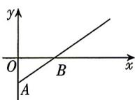
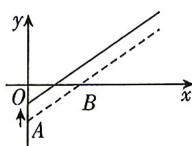
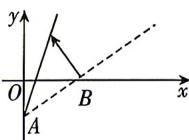

<!-- question-source:start -->
11. (多选)[浙江台金七校2025高一期中联考]如图①是反映某条公交线路收支差额(即营运所得票价收入与付出成本的差)y与乘客量x之间关系的图象.由于目前该条公交线路亏损,公司有关人员提出了两种调整的建议,如图②③所示.

图①
图②

图③

则下列说法中正确的有 ( )

A. 图②的建议: 提高成本, 并提高票价

B. 图②的建议: 降低成本, 并保持票价不变

C. 图③的建议: 提高票价, 并保持成本不变

D. 图③的建议: 提高票价, 并降低成本

## 刷能力
<!-- question-source:end -->

![[Q00071121A1]]
