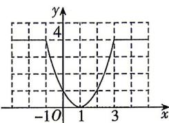

> [!faq]- 答案与解析
>
> > [!success]- **【答案】** ACD
>
> > [!note]- **【解析】**
> > B【解析】当 $x < 4$ 时， $f(x) = -x^2 - 2mx - 30 = -(x + m)^2 + m^2 - 30$ 又函数 $f(x)$ 在 $\mathbf{R}$ 上是增函数，则 $-m \geqslant 4$ 即 $m \leqslant -4$ 当 $x \geqslant 4$ 时， $f(x) = \frac{3x + m}{x - 1} = 3 + \frac{m + 3}{x - 1}$ ，由函数 $f(x)$ 在 $\mathbf{R}$ 上是增函数可知，[186]
> >
> > $f_{4}(x)$ 的图象如图所示，
> >
> > 
> >
> > 所以 $f_{4}(2) = f(2) = 2^{2} - 2 \times 2 + 1 = 1$ ，故A正确；由图可知 $f_{4}(x)$ 在 $(- \infty, 1)$ 上不单调递减，故B错误；将函数 $f_{4}(x)$ 的图象向左平移1个单位长度，所得图象关于 $y$ 轴对称，即 $f_{4}(x + 1)$ 为偶函数，故C正确；因为 $f_{4}(x) \in [0, 4]$ ，当 $x \in [0, 4]$ 时， $f(x) = x^{2} - 2x + 1 = (x - 1)^{2} \in [0, 9]$ ，即 $y = f(f_{4}(x))$ 的值域为 $[0, 9]$ ，故D正确。
> >
> > 故选 **ACD**。
