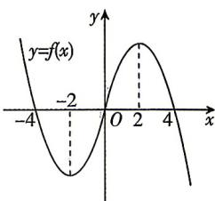

> [!faq]- 答案与解析
>
> > [!success]- **【答案】** ACD
>
> > [!note]- **【解析】**
> > ACD 【解析】对于 A: 因为 $f(x)$ 是定义在 R 上的奇函数, 且当 $x \geqslant 0$ 时, $f(x) = -x^{2} + 4x + a$ ,
> > 所以 $f(0)=a=0$ ，即 a=0，故 A 正确.
> > 对于 B: 由 A 可得当 $x \geqslant 0$ 时, $f(x) = -x^{2} + 4x$ ,
> > 设 x<0，则 -x>0，所以 $f(x) = -f(-x) = -[-(-x)^{2} + 4 \times (-x)] = x^{2} + 4x$ 所以当 x<0 时, $f(x)=x^{2}+4x$ , 故 B 错误.
> > 对于 C: 因为当 $x \geqslant 0$ 时, $f(x) = -x^{2} + 4x$ ,
> > 设 $\forall x_{1}, x_{2} \in (0, +\infty)$ ，则 $\frac{f(x_{1}) + f(x_{2})}{2} - f\left(\frac{x_{1} + x_{2}}{2}\right) = \frac{-x_{1}^{2} + 4x_{1} - x_{2}^{2} + 4x_{2}}{2} - \left[-\left(\frac{x_{1} + x_{2}}{2}\right)^{2} + 4\left(\frac{x_{1} + x_{2}}{2}\right)\right] = -\frac{(x_{1}-x_{2})^{2}}{4} \leqslant 0,$ 所以 $\frac{f(x_{1})+f(x_{2})}{2}\leqslant f\left(\frac{x_{1}+x_{2}}{2}\right)$ ，故 C 正确.
> > 对于 D: 由 B 可知 $f(x)=\left\{\begin{aligned}-x^{2}+4x,x&\geqslant0,\\x^{2}+4x,x&<0,\end{aligned}\right.$ 作出函数 $f(x)$ 的图象，如图所示.
> >
> > 
> >
> > 当 $-4<b\leqslant0$ 时， $f(b)\leqslant f(-4)$ ，由图知 $f(x)$ 在区间 $[-4,b)$ 上有最大值 $f(-4)$ ，满足题意；
> > 当 $0<b\leqslant2$ 时， $f(b)>f(-4)$ ，由图知 $f(x)$ 在区间 $[-4,b)$ 上无最大值，不满足题意；当b>2时，由图知 $f(x)$ 在区间 $[-4,b)$ 上有最大值 $f(2)$ ，满足题意。
> > 综上，实数 b 的取值范围为 $(-4,0] \cup (2,+\infty)$ ，故 D 正确.
> >
> > 故选 **ACD**.
