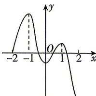

<!-- question-source:start -->
3. 如图是函数 $y=f(x)$ 的图象, 其定义域为 $[-2, +\infty)$ , 则函数 $f(x)$ 的单调递减区间是 ( )

A. $[-1,0)$ B. $[1, + \infty)$ C. $[-1,0), [1, + \infty)$ D. $[-1,0) \cup [1, + \infty)$

<!-- question-source:end -->

![[Q00071002A1]]
