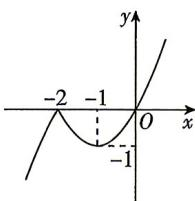

> [!faq]- 答案与解析
>
> > [!success]- **【答案】** D
>
> > [!note]- **【解析】**
> > D 【解析】 $f(x) = x \mid x + 2 \mid = \left\{ \begin{aligned} & x(x+2), x \geqslant -2, \\ & -x(x+2), x < -2, \end{aligned} \right.$ 作出 $f(x)$ 的大致图象如图所示，
> >
> > 
> >
> > 由图知,函数 $f(x)=x|x+2|$ 的单调递增区间为 $(-∞,-2),(-1,+∞)$ ,
> >
> > 故选 **D**.
