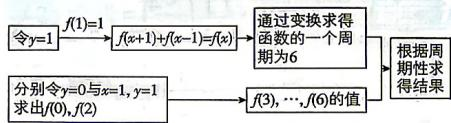

> [!faq]- 答案与解析
>
> > [!success]- **【答案】** A
>
> > [!note]- **【解析】**
> > A
> >
> > ## 思路导引
> >
> > 
> >
> > 【解析】在 $f(x+y)+f(x-y)=f(x)\cdot f(y)$ 中，令y=1，得 $f(x+1)+f(x-1)=f(x)\cdot f(1)$ ，所以 $f(x+1)+f(x-1)=f(x)$ ①，所以 $f(x+2)+f(x)=f(x+1)$ ②.
> > 由①②相加，整理得 $f(x+2)+f(x-1)=0$ ，所以 $f(x+3)+f(x)=0$ ，即 $f(x+3)=-f(x)$ ，所以 $f(x+6)=-f(x+3)=f(x)$ ，所以函数 $f(x)$ 的一个周期为6.
> > 在 $f(x+y)+f(x-y)=f(x)f(y)$ 中，令y=0，得 $f(x)+f(x)=f(x)f(0)$ ，所以 $f(0)=2$ .
> > 令x=1,y=1,得 $f(2)+f(0)=f(1)f(1)$ ，所以 $f(2)=-1$ .
> > 由 $f(x+3)=-f(x)$ ，得 $f(3)=-f(0)=-2$ ， $f(4)=-f(1)=-1,f(5)=-f(2)=1$ ， $f(6)=-f(3)=2$ ，所以 $f(1)+f(2)+\cdots+f(6)=1-1-2-1+1+2=0$ 。所以 $\sum_{k=1}^{22}f(k)=3[f(1)+f(2)+\cdots+f(6)]+f(1)+f(2)+f(3)+f(4)=3\times0+1-1-2-1=-3$ ，
> >
> > 故选 **A**.
