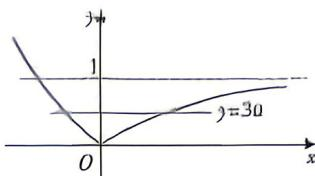
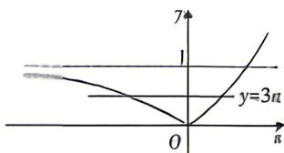

> [!faq]- 答案与解析
>
> > [!success]- **【答案】** D
>
> > [!note]- **【解析】**
> > D 【解析】因为对任意 $x_{1} \neq x_{2}$ ，都有 $\frac{f(x_{1})-f(x_{2})}{x_{1}-x_{3}}>0$ 成立，
> > 所以 $f(x)$ 在 $(-∞, +∞)$ 上单调递增，
> > 所以 $\begin{cases}a>1,\\a-1>0,\end{cases}$ 解得 $a\geqslant2$ $a+a^{n}\geqslant3+(a+1)\times0.$ 故选 D.
> >
> > [200]
> >
> > 规律方法 分段函数单调不仅需要考虑每一段函数的单调性相同,还应考虑在端点处的衔接情况.
> >
> > B. C 【解析】当 $0 < u < 1$ 时, $y = |u^2 - 1|$ 的大数图象如图①所示, 由已知得 $0 < 3u < 1$ , 照板; 调品枚 $\rightarrow u - 1$ 的图象在第四象质的部分沿轴翻折后即得 $y = |u^2 - 1|$ 的图象 $\therefore 0 \leqslant u < \frac{1}{3}$ ;
> >
> > 
> > 图①
> >
> > 当 $a > 1$ 时 $\gamma = |u^2 - 1|$ 的大数图象如图②所示。 $①$ 图板：将函数 $y = u^2 - 1$ 的图在第三单组的部分沿 $x$ 轴翻折后即得 $y = |u^2 - 1|$ 的图象
> > 由已知可得 $0 < 3a < 1, 0 < a < \frac{1}{3}$ ，结合 $a > 1$ 可得 $a$ 无解，
> >
> > 
> > 图②
> >
> > 综上可知， $a$ 的取值范围为 $\left(0,\frac{1}{3}\right)$
> >
> > 故选 **C**.
