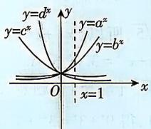

> [!faq]- 答案与解析
>
> > [!success]- **【答案】** D
>
> > [!note]- **【解析】**
> > D 【解析】由题图可知函数 $y = a^{x}, y = b^{x}$ 均单调递增，则 a > 1, b > 1.
> > 当 x = -1 时， $a^{-1} = \frac{1}{a} > b^{-1} = \frac{1}{b}$ ，得 a < b，所以 b > a > 1。故选 D.
> > 规律方法 不同底数的指数函数图象的
> > 规律
> >
> > 若 $y = a^{x}, y = b^{x}$ , $y = c^{x}, y = d^{x} (a, b, c, d$ 均大于 0
> > 且不等于1）的图象如图所示，
> > 则 a > b > 1 > c > d > 0
> >
> > 
> >
> > 简记规律:在第一象限,按照逆时针方向观察,对应的指数函数的底数逐渐增大.
